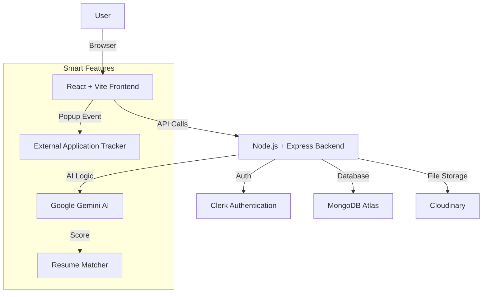

# AI-Powered Job Tracker with Smart Matching 🚀

##  Live Demo
- **Frontend Vercel:** [https://assignment-ai-powered-job-tracker-w.vercel.app/](https://assignment-ai-powered-job-tracker-w.vercel.app/)
- **Backend Render:** [https://assignment-ai-powered-job-tracker-with.onrender.com](https://assignment-ai-powered-job-tracker-with.onrender.com)

##  Project Overview
A futuristic job portal that leverages **Google Gemini AI** to smart-match candidates with jobs based on their resumes. It features a unique **External Job Tracking System** that mimics LinkedIn, tracking applications even on third-party sites.

##  Architecture Diagram
*(Visual representation of the flow: React Frontend -> Express API -> MongoDB Atlas + Gemini AI)*

##  Tech Stack
- **Frontend:** React.js, TailwindCSS (Glassmorphism UI), Framer Motion, Context API
- **Backend:** Node.js, Express.js
- **Database:** MongoDB Atlas
- **AI:** Google Gemini 1.5 Flash
- **Auth:** Clerk
- **Storage:** Cloudinary

##  Key Features (Assignment Checklist Configured)

### 1.  Job Feed & Smart Filters
- Fetch jobs from internal DB/Seed.
- **Filters:** Role, Skills (Multi-select), Date Posted, Job Type, Work Mode, Location, Match Score.
- **Search:** Universal search bar for Title, Description, and Skills.

### 2.  Resume Upload & Parsing
- Users upload PDF resumes during Onboarding.
- `pdf-parse` extracts text for AI analysis.
- Resumes stored securely on Cloudinary.

### 3.  AI-Powered Job Matching
- **Logic:** We send the *Job Description* and *Parsed Resume Text* to Gemini AI.
- **Prompt Engineering:** The AI returns a JSON score (0-100) and a one-line explanation.
- **UI:** Jobs show Green (>70%), Yellow (40-70%), Gray (<40%) badges.

### 4.  Smart Application Tracking (Popup Flow)
- **The Challenge:** How to track clicks on external links?
- **Our Solution:**
    1. User clicks "Apply External".
    2. Link opens in new tab.
    3. **Immediate Popup** appears on our site: *"Did you apply?"*
    4. If "Yes", we record it in the database.
- **Dashboard:** Users can update status (Interview, Offer, Rejected) later.

### 5.  AI Sidebar Assistant
- Chat interface powered by Gemini.
- Capabilities: "Find me remote React jobs", "How does matching work?", "Show high match jobs".

## 📈 Scalability & Tradeoffs
- **Current:** MongoDB handles 100s of jobs easily. Aggregation pipelines used for filtering.
- **Scaling to 10k Users:**
    - **Caching:** Implement Redis for Job Feeds to reduce DB hits.
    - **Queueing:** Move AI Matching to a background queue (BullMQ) to prevent API rate limits.
    - **Indexing:** MongoDB Indexes on `title`, `skills`, `location` for fast search.
---
*Created by [Saurabh Biswal]*
