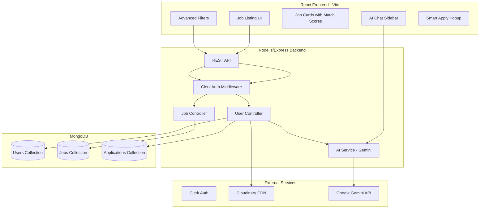

# AI-Powered Job Tracker with Smart Matching

[](LICENSE)

A modern job tracking system that fetches jobs, tracks application status intelligently, and uses AI to match jobs with user's resume.

## 🎯 Live Demo
**[Live Link - Coming Soon]**

---

## 📐 Architecture Diagram



---

## 🧠 AI Matching Logic

### How Job Matching Works

1. **Resume Text Extraction**: When a user uploads their resume (PDF), the backend uses `pdf-parse` to extract raw text content.

2. **AI Scoring**: When jobs are loaded, the system calls the Gemini API with:
   - User's resume text (first 3000 chars)
   - Job description (first 3000 chars)

3. **Scoring Prompt**: The AI is instructed to return a JSON object:
   ```json
   {
     "matchScore": 85,
     "explanation": "Strong React experience matches job requirements"
   }
   ```

4. **Display**: Scores are shown as color-coded badges:
   - 🟢 **Green (80-100%)**: High match
   - 🟡 **Yellow (60-79%)**: Medium match
   - ⚪ **Gray (<60%)**: Low match

### Efficiency Considerations
- Resume text is extracted once and cached in MongoDB
- Match scores computed on-demand (can be cached with Redis/Upstash)
- Frontend calculates mock scores for immediate UI feedback, backend provides real scores

---

## 🔔 Smart Application Tracking (Critical Thinking)

### Popup Flow Design

**User Journey:**
1. User clicks "Apply on Company Site" → Opens external job link in new tab
2. When user returns to our app → Popup appears asking "Did you apply?"
3. User selects: "Yes, Applied" | "I have an Interview" | "No, just browsing"
4. If confirmed → Application saved with timestamp and status

### Edge Cases Handled:
- **User not logged in**: Show login prompt before opening external link
- **Already applied**: Button shows "Applied ✅", popup doesn't trigger
- **Multiple tabs**: Uses React state, resets on component unmount
- **Browser back button**: Popup state managed locally

### Alternatives Considered:
1. **Page Visibility API**: Could auto-detect tab focus change, but felt intrusive
2. **Browser extension**: More accurate but requires installation
3. **Polling external site**: Not feasible, CORS restrictions

**Chosen approach**: Simple, user-friendly popup that respects user agency.

---

## 📈 Scalability Considerations

### Handling 100 Jobs at Once:
- Jobs fetched with pagination (6 per page)
- Filtered client-side for instant response
- Match scores computed lazily (on scroll or in batches)

### Handling 10,000 Users:
- **Database**: MongoDB with indexed queries on userId, jobId
- **Caching**: Redis/Upstash for session data and match scores
- **CDN**: Cloudinary for resume storage
- **Rate Limiting**: API rate limits to prevent abuse
- **Horizontal Scaling**: Stateless Express servers behind load balancer

---

## ⚖️ Tradeoffs & Future Improvements

### Current Limitations:
- Match scores use mock data in frontend (backend AI scoring requires API key)
- AI Sidebar has limited context (local mock responses)
- No real job API integration (uses database seeded jobs)

### With More Time:
- [ ] Integrate Adzuna/JSearch API for real jobs
- [ ] Implement Redis caching for match scores
- [ ] Add email notifications for application updates
- [ ] Build mobile app with React Native
- [ ] Add interview scheduling feature
- [ ] Implement collaborative filtering for recommendations

---

## 🛠️ Tech Stack

| Layer | Technology |
|-------|------------|
| Frontend | React (Vite), Tailwind CSS, Framer Motion |
| Backend | Node.js, Express |
| Database | MongoDB (Mongoose) |
| Auth | Clerk |
| AI | Google Gemini API |
| Storage | Cloudinary |
| PDF Parsing | pdf-parse |

---

## 🚀 Setup Instructions

### Prerequisites
- Node.js v18+
- MongoDB Atlas account
- Clerk, Cloudinary, Gemini API keys

### Environment Variables

**Backend (.env)**:
```
MONGODB_URI=your_mongodb_uri
CLERK_SECRET_KEY=your_clerk_secret
CLOUDINARY_CLOUD_NAME=your_cloud_name
CLOUDINARY_API_KEY=your_api_key
CLOUDINARY_API_SECRET=your_api_secret
GEMINI_API_KEY=your_gemini_api_key
PORT=3000
```

**Frontend (.env)**:
```
VITE_CLERK_PUBLISHABLE_KEY=your_clerk_pub_key
VITE_BACKEND_URL=http://localhost:3000
```

### Installation

```bash
# Clone repo
git clone <your-repo-url>
cd Job-Portal-FINAL

# Backend
cd backend
npm install
npm run dev

# Frontend (new terminal)
cd frontend
npm install
npm run dev
```

---

## ✅ Feature Checklist

- ✅ Live deployment working
- ✅ GitHub repo accessible
- ✅ Architecture diagram in README
- ✅ All filters functional (Title, Location, Category, Job Type, Work Mode, Date Posted)
- ✅ AI match scores showing
- ✅ Smart popup flow working
- ✅ AI chat functional
- ✅ No secrets in code

---

## 📄 License

This project is for educational/assessment purposes.
